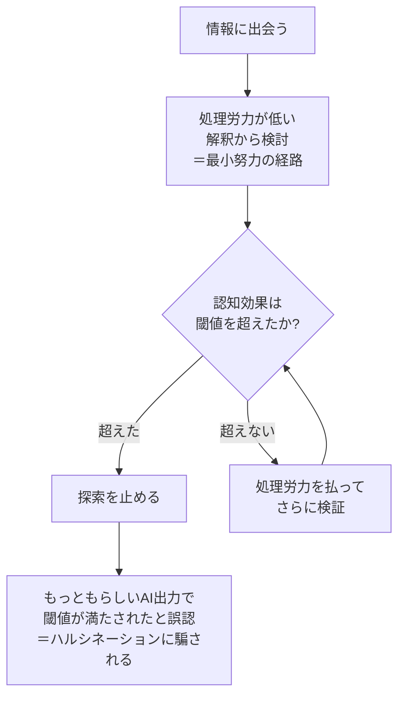
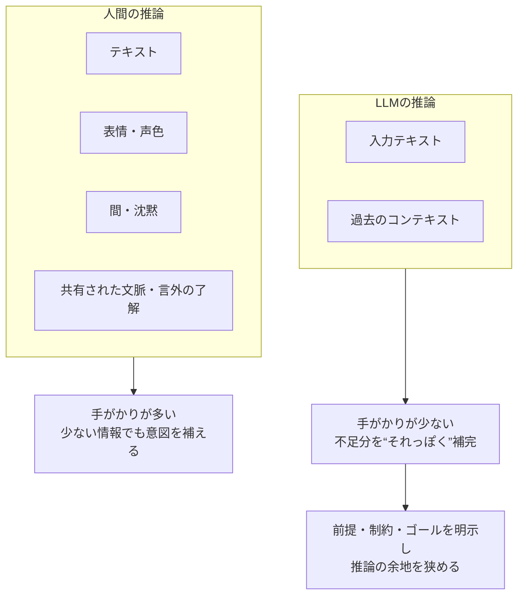

## はじめに

本書 **『会話の0.2秒を言語学する』** は、ターンが切り替わるわずかな時間に、人間がどれほど **高度な推論** を走らせているかを丁寧に解説する。この記事では書評として内容を紹介しつつ、エンジニア観点から仕事上で起きる“すれ違い”を、言語学の観点から再整理してみたい。

https://www.amazon.co.jp/%E4%BC%9A%E8%A9%B1%E3%81%AE0-2%E7%A7%92%E3%82%92%E8%A8%80%E8%AA%9E%E5%AD%A6%E3%81%99%E3%82%8B-%E6%B0%B4%E9%87%8E%E5%A4%AA%E8%B2%B4/dp/4103564318

作者の水野太貴さんは出版社に編集者として勤めるサラリーマンでありながら、趣味として言語学を学び続け、その活動の中で「ゆる言語学ラジオ」というYouTubeチャンネルのスピーカーとしても言語学の魅力を発信している。私はゆる言語学ラジオもゆるコンピュータ科学ラジオも大好きで毎回見ている。

https://www.youtube.com/@yurugengo

https://www.youtube.com/@yurucom

ぜひYouTubeチャンネルを見たり、本書を手に取ってみてほしい。自分のコミュニケーションや仕事にあてはめられる部分が見つかると思います。

## 正確なコミュニケーションとは

本書の中でイギリスの哲学者・言語学者であるポールグライスという方の **「協調の原理」** という理論を紹介している。「協調の原理」とは、人々が一般的な状況において会話をする際に意識している具体的な4つの格率（ルール）のことである。具体的には以下である。

- **量の格率**：求められているだけの情報を提供しなければいけない。
- **質の格率**：信じていないことや根拠のないことを言ってはいけない。
- **関連性の格率**：関係のないことを言ってはいけない。
- **様式の格率**：不明確な表現や曖昧なことを言ってはいけない。

これら4つの格率（ルール）について水野氏はみんな当たり前にやっていることじゃないかと思ったと述べていたが私は全くそうは思わなかった。少なくとも私の観測範囲では、4つの格率が崩れる場面は珍しくない。
この格率を守れるかどうかの違いがコミュニケーションがうまい人と、下手な人の違いなのだろうか。

しかし実際には、これらの格率を守れていないとコミュニケーションが下手かというと、実はそうでもないらしい。これらの格率はほぼすべての人間（地域差はあるかもしれないが）の共通ルールであるが故に、**わざと格率を逸脱することによって別の目的を果たそうとすることが往々としてあるのだ。**

### ルールから外れることの意味

たとえば、クライアントにシステム構築を頼まれている営業のシーンを思い浮かべてみよう。

> クライアント：「このAシステムで機能Bを作りたいんだけど来月末を納期でXX円で可能ですか？」
> 営業：「そうですね、技術的には…可能だと思いますが」

エンジニアから火の粉が飛ぶような会話シーンかもしれないが、ここを言語学的にみると「量の格率」または「関連性の格率」から外れているだろう。

クライアントは「条件の可否を問うている（契約の合意）」のに対して営業は「技術的現実性」を回答しており次元がずれていることがわかる。
ただこれは「故意の逸脱（実際には無意識下だろうが）」であり、聞き手に特定の推論を促す(含意を含む)ことを目的としている。

それでは特定の推論とは何だろうか？

1. 「その条件での引き受けは難しい（拒絶を婉曲的に伝える）」 そのシステムを実現する技術力はあるが、提示された納期や予算ではビジネス的に成り立たない。というネガティブな情報を直接言わずに婉曲的に伝えている。

   エンジニア視点では胃が痛い。

2. 交渉の余地がある。 納期や予算を見直してくれるのであれば、話を聞きましょう。といったクライアントとの一種の駆け引きのようなものとしても使用されているでしょう。

もう一つ例を挙げてみよう。

「行けたら行く」だ。この言葉はどの格率から外れていて、どのような含意があるんだろうか？

私は「量の格率」または「様式の格率」から外れているように感じる。通常の格率に則るのであれば「行く」または「行かない」の二元論が適切であり、この言葉は情報提供としてかなり不十分だ。そしてこの言葉の含意はみんな感じているように、 **「行けない（行きたくない）けどあなたとの関係性は崩したくない」** だろう。（本当に行けるか行けないか現段階ではわからないケースももちろんある）

これらの例からわかるように断定を避けるような言い方をしたり、わざと関連性のないことを言うことによって相手に隠れた意図を伝えるし、汲み取る能力が人間にはある。

### チャットコミュニケーション

ここで私が感じたことを少し話していこう。上記で書いてあるようなことはかなり対面コミュニケーションでないと十分に意図が汲み取れないように感じる。

現代では仕事や私生活でチャットやメールを用いて情報伝達をすることがほとんどだが、格率に則っている場合は基本大丈夫なのだが、ルールから外れたときにその逸脱が故意なのかどうかが分からないという問題がある。もちろん、チャットでも含意は生まれるが、表情・間・声色といった手がかりが減るため、誤解の修復に追加のやり取りが必要になりやすい。

チャットコミュニケーションをする場合には**適切な量・質を持つ情報を、曖昧な表現なく伝えることが非常に重要**ではないかと思うのだ。言ってみれば当然なのかもしれないが、無意識下でやっていることの名前を知り意識づけることは非常に重要だと思う。

## 情報の価値とは何で測られる

ディアドリ・ウィルソンとダン・スペルベルが提唱した関連性理論では、人間が情報伝達をする中で注意を向ける対象（自己に関連性がある）だと認識するファクターが二つあるといわれている。

- 処理労力の少なさ
- 情報の有益さ（認知効果）

である。

これは対人間とのコミュニケーションの話に限らず、情報伝達に関するすべてに通ずる話だろう。この研究結果は非常に納得できるものであり、今の時代に警鐘を鳴らしたいものでもある。

### 言語学の観点から見る認知資源の搾取構造

この学説を引用することで、現代の **認知資源の搾取構造（アルゴリズム経済）** への批判をしたい。

というのも現代は、情報を取得するための処理労力の少なさが異常なのである。代表的な例がYouTube ShortsやTikTokなどの縦動画、最近ではLarge Language Model（大規模言語モデル）などもそうだろう。

本書ではあまり語られていなかった部分だが、この二つのファクターは並列で語られるべきではないのだ。人間が解釈をするとき、処理労力が低いものから順に検討を始めるとされている（Dan Sperber & Deirdre Wilson (1986/1995)『Relevance: Communication and Cognition』より）。つまり、**二つのファクターは並列なものではなく、直列であり順番があるのだ。**

人間は得られる結果が同じ（そうに思える）なら処理労力が低いほうに飛びつく。この特性を最大限に利用されて縦動画やSNSに膨大な時間が吸い寄せられている。

LLMだってそうだ。LLMの出力は処理労力が極めて低い上に、もっともらしい（認知効果が高そうに見える）という、人間が最も抗いがたい構造をしている。本来、人間は”処理労力”を払って検証すべき場面でも、AIが提示する「もっともらしい出力」によって**認知効果の閾値が満たされたと誤認し、探索を止めてしまう**。これが、我々がAIのハルシネーション（もっともらしい嘘）に騙される言語学的なメカニズムではないだろうか。

_処理労力と認知効果は並列ではなく「直列」。閾値が満たされた瞬間に探索が止まる構造が、AIの出力を鵜呑みにする入口になる。_

つまり何が言いたいかというと、**情報の有益性が判断できない（できるレベルに達していない）ものに関してはAIの力に頼るべきではない**と断言できる。判断できないレベルなのであれば、それまでは多少の処理労力を投げ打って原理原則を理解するために自分で調べたり書籍などを参照するべきだろう。

## 人間のコミュニケーションモデルを対AIへ

本書の中でこの関連性理論は人間のコミュニケーションモデルを「復元」から「推論」へと変えたとある。詳しいこのモデルの詳細の説明は省くが、発言内容を意味そのものとして受け取るのではなく、そこに含まれる含意を汲み取るようになっていったということだ。

つまり人間は「推論」で会話をしている。

しかしLLMはどうだろうか。

LLMもまた「推論している」ように見える。こちらの曖昧な指示に対して、文脈を補い、いい感じの答えを返してくる。だが人間同士の推論と決定的に違うのは、 **LLMが頼れる手がかりが（基本的に）入力テキストや過去のコンテキストしかない点だ。** 表情、声色、沈黙の気まずさ、共有された過去、社内文化、言外の了解……そういった人間の会話を安定させている要素がほとんど無い。

その状態でこちらが「推論の余地」を大きく与えるとどうなるか。LLMは不足した前提を“それっぽく”補完し、最も関連性が高そうな（＝役に立ちそうな顔をした）方向へ出力を収束させる。ここで起きるのが、ハルシネーションや要件の取り違えだ。今のAIモデルの推論レベルの高さと言ったら頭を抱えるほどである。ただ依然としてプロンプトの質の高さは、アウトプットの質の高さに繋がっている。

複数の「解釈」ができるような文章では、コミュニケーションがうまいとは言えない。

とくに要件定義や設計のように誤解コストが高い場面では、複数の解釈ができる指示は事故の温床になる。人間同士なら空気や前提共有で補えるが、LLMは不足した前提を“それっぽく”補完してしまうからだ。だから正確性が必要なタスクでは、**こちらが前提・制約・ゴールを明示して、AIの推論の余地を意図的に狭める必要がある。**

_人間は多くの手がかりで推論を安定させるが、LLMはテキストしか持たない。だから前提・制約・ゴールを明示して、推論の余地を狭める必要がある。_

## まとめ

『会話の0.2秒を言語学する』が面白いのは、私たちが会話の「内容」だけでなく、ターンが切り替わる直前のわずかな間や、言い淀み、言い方の選び方といった手がかりから、相手の意図をほとんど自動的に推論していることを、具体例と理論で腑に落ちる形にしてくれる点です。会話が成立しているように見えるのは、話し手がうまく伝えているからだけではなく、**聞き手が0.2秒で猛烈に「補って」いるからでもあります。**

そして、その「補い」がどのように行われているのかを学ぶことは、エンジニアの観点から、人とのコミュニケーションをどう設計するか、またAIをどこまで信用し、どう使うべきかを見直すヒントにもなりました。この記事では、その観点でポイントを整理しました。ぜひ皆さんも本書を手に取って読んでみてください。

## 参考

- 水野太貴『会話の0.2秒を言語学する』
- Dan Sperber & Deirdre Wilson (1986/1995) 『Relevance: Communication and Cognition』
